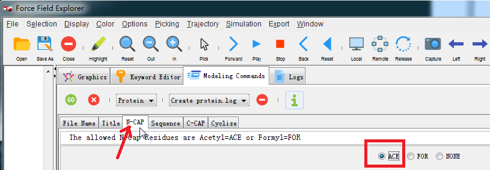

## <center>实验2 用 Tinker 做分子模拟 (2)</center>

提交结构图像和最少至少20行文本输出到实验报告中。

1. 转换 PDB 文件为 xyz 文件用于分子力学计算

  - 启动 FFE，用菜单 File | Load from PDB 获取 1ejg, 这是一个称为 crambin （一种小的种子储存蛋白）的小蛋白。
  - 运行 pdbxyz 命令将它转换为 1ejg.xyz. 你要记得，是在 Modeling Command 选项卡指定这个命令。
  - 在左面板上选择 1ejg.xyz, 运行 analyze 去计算能量，运行 minimize 去精化结构。
  - 注意，由 FFE 创建的 1ejg.xyz, 1ejg.key 等文件都放置在下列路径
    C:\用户\xxxx\MolecularTools\PDBdownloads

  ```
  提示：通过上述步骤，原则上能够设置任何 PDB. 但是，有的 PDB 可能包含离子或配体，而 pdbxyz 可能不能正确处理它们。还有一些蛋白可能有太多丢失的原子/残基。因此，若遇到转换困难，可能必须编辑这个 PDB 文件，删除任何杂散原子（非蛋白质原子），再对改好的结构执行计算。为研究这些配体，必须使用其他程序给出的参数。
  *Swiss-PDB viewer 是一个可以添加丢失残基和 loop 的免费软件. 
  软件网址：http://spdbv.vital-it.ch/loop_tut.html
  ```

2. 从序列构建自己的肽链或蛋白质

  

  (1) 启动 FFE，点击窗口中的 Modeling Commands 卡片头（图示箭头所指）
  

  (2) 点击卡片中的下拉按钮，选择 Protein 列表项（图示箭头所指）
  

  (3) 点击 File Name 子卡片头（图示箭头所指），然后，修改编辑框（图示红框处）内容，将生成分子文件命名为 pep
  

  (4) 选择追加 N 端残基 ACE，C 端追加残基 NME
  
  

  (5) 点击 Sequence 子卡片头，选择 Alpha Helix (L) 列表项，目的是生成左$\alpha$螺旋结构的分子
  

  (6) 连点 7 次 ALA 氨基酸按钮生成 7 残基聚苯胺
  

  (7) 点击 Cyclize 子卡片头，选择 N 单选钮，不生成环状分子（即生成链式分子），再点击绿色的 Go 按钮
  

  (8) 弹出窗口选择力场参数为 amber99sb.prm, 你当然也可以选择列出的其它想要的力场参数
  

  (9) 此时生成了所需要的 6 个结构文件（一般路径在软件安装目录），你可以将这些文件移动到自己的工作目录，进行后续的工作。
  

  (10) 现在构造分子完毕，可以进行更多的建模命令了（分子构建之前只有 Nucleic 和 Protein 两个命令，现在大约有 27 个）。
  

3. 通过模拟退火 (anneal) 做肽折叠

  先用文本编辑器打开 pep.key, 如图添加红框内容，再保存退出。
  

  然后，执行 minimize 建模命令（参数不用改，就用红框中的默认值就行了）
  

  接着执行模拟退火 anneal 建模命令，依次点击每个卡片头，设定好各项参数
  
  具体参数可以这样设定：

  > - 初温和末温开尔文度数，绿框中 1000, 0 改成 1000, 298
  >   即分子先加热到 1000 开，再冷却至 298 开
  >
  > - 输入平衡步数，默认值[0]，改成 1000
  >   即退火之前先平衡 2 皮秒
  >
  > - 输入冷却协议步数 [2000]，改成 25000
  >   即在 50 皮秒之内从 1000 开冷却至 298 开。显然，这不能反映真实的肽折叠过程。因为，即使是小肽也需要几个纳秒时间完成折叠。更大的分子则需要更长的折叠时间。
  >
  > - 使用“线性、S 形或指数”冷却协议，选 L
  >   这是规定冷却时温度下降曲线形式为线性下降。
  >
  > - 时间步设为 2 飞秒
  >
  > - 转存间隔 1 皮秒
  > -
  > - 原子重量放大倍数就用默认值就行了 (10^x [x=0.0]: 0)

  **提示：** 还可以将所有参数放在文本文件 input.txt 中，然后在命令行直接运行命令，下列命令和上面的退火模拟全过程等价：

  ```bash
  cd "pep.xyz 和 pep.key 所在目录"
  %TINKDIR%\bin\anneal.exe pep.xyz < input.txt > output.txt
  ```

  另外，在 Windows 系统下，命令无法在后台运行，所以运行时千万不能关闭 FFE 或运行命令所在窗口。


